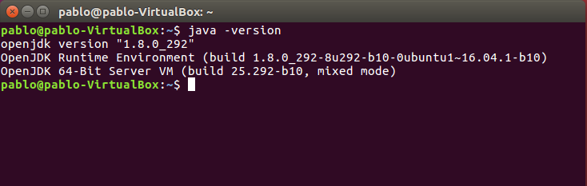
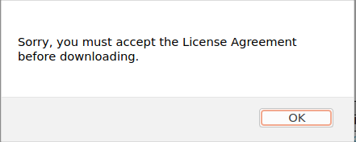
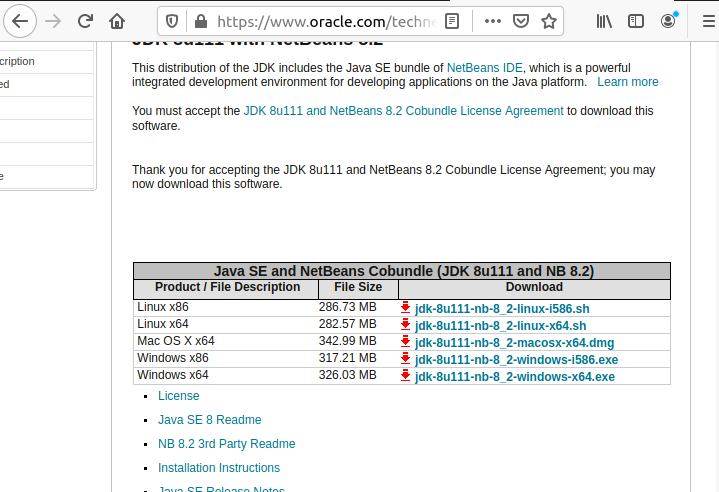
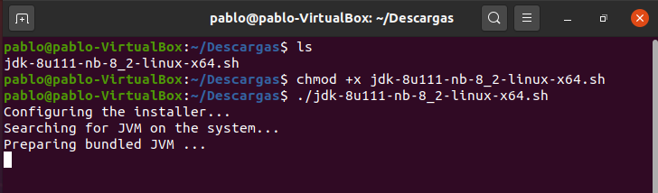
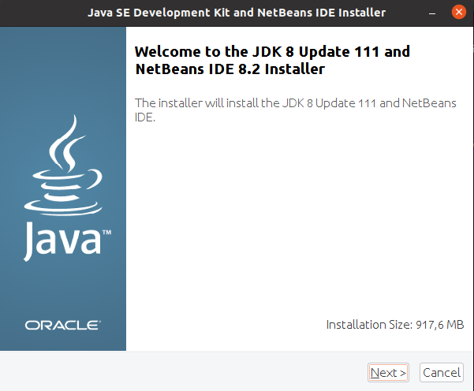
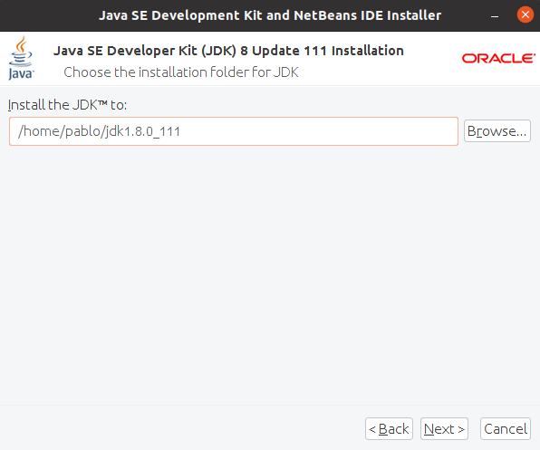
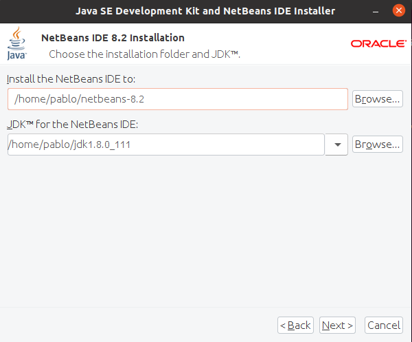
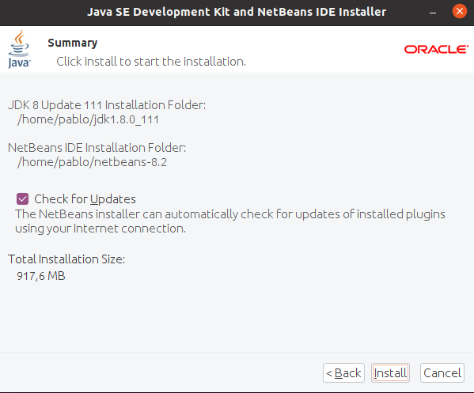

# Instalación del IDE Netbeans 8
## Indice
- **[1. Requisitos](#requisitos)**
- **[2. Instalación](#instalación)**
### Requisitos
Para poder comenzar con la práctica necesitaremos tener instalado Java para que el IDE Netbeans pueda funcionar correctamente, aunque si no está instalado java lo podremos pero no funcionará. A modo de comprobación de que tenemos el java instalado deberemos usar el comando **“java -version”**.

### Instalación
Para comenzar con la instalación deberemos ir al siguiente enlace **“https://www.oracle.com/technetwork/java/javase/downloads/jdk-netbeans-jsp-3413139-esa.html”**, aqui descargaremos la version **“jdk-8u111-nb-8_2-linux-x64.sh”**. Tendremos que aceptar la licencia.

Cuando lo descarguemos, en el terminal, iremos al directorio en donde descargamos y pondremos lo siguiente para poder comenzar con la instalación:

Tras la instalación se nos abrirá un instalador el cual tendremos que seguir los pasos.

Luego seleccionamos la carpeta del JDK.

Tras esto seleccionamos la carpeta en donde colocaremos la instalación del Netbeans y JDK.

Finalmente terminaremos de instalarlo y luego lo reiniciamos para disfrutar de Netbeans.

